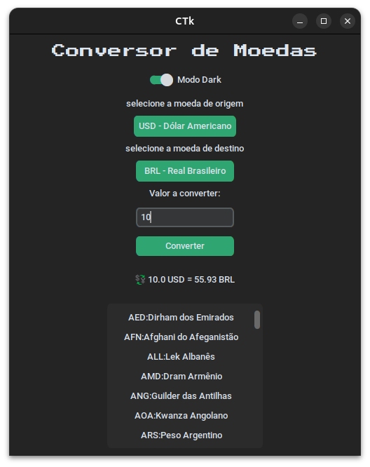
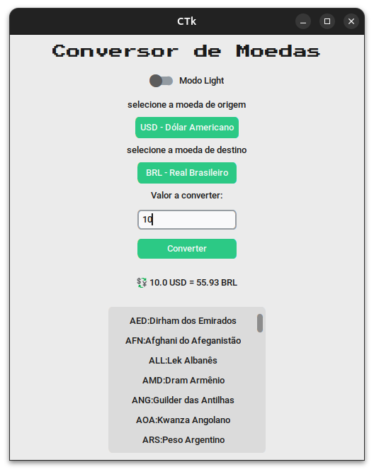

# 💱 Conversor de Moedas com Python e CustomTkinter

Este é um aplicativo desktop simples e elegante feito com `Python` e `CustomTkinter`, que permite ao usuário converter moedas em tempo real usando dados da [AwesomeAPI](https://docs.awesomeapi.com.br).

## ✨ Funcionalidades

- Seleção de moeda de origem e destino com nomes completos.
- Conversão em tempo real com base na cotação atual.
- Interface moderna com modo claro/escuro.
- Lista rolável com todas as moedas disponíveis.
- Atualização dinâmica das opções de destino com base na origem escolhida.

## 📦 Tecnologias Utilizadas

- Python 3.10+
- [CustomTkinter](https://github.com/TomSchimansky/CustomTkinter)
- Requests
- AwesomeAPI

## 📷 Interface

| Interface com Modo Escuro | Modo Claro |
|---------------------------|------------|
|  |  |

## ⚙️ Como Usar

1. Clone o repositório:
   ```
   git clone https://github.com/Marcosgmp/Conversor-de-moedas.git
   cd conversor-moedas
  
2. Instale as dependências  
  ```
  pip install -r requirements.txt
```
3. Execute o App
  ```
   python main.py  
```
### ⚠️ Avisos
- É necessário estar conectado à internet para realizar as conversões.
- Os dados são obtidos em tempo real via [AwesomeAPI](https://docs.awesomeapi.com.br).
- Os arquivos *.xml são utilizados para popular as listas de moedas disponíveis, obtidas do próprio site da API.


